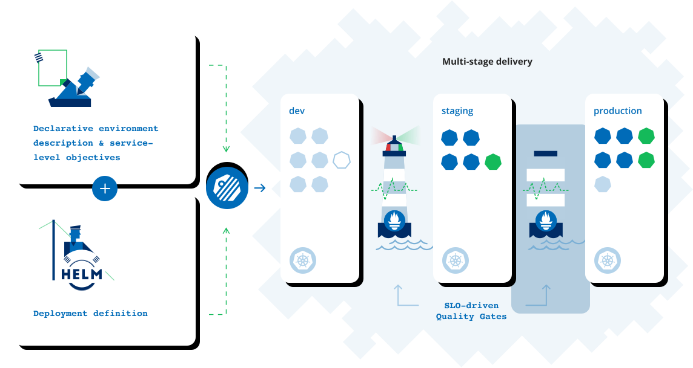

# keptn installation on Azure

Automatically set up a multi-stage environment with built-in quality gates orchestrating your continuous delivery workflow, and integrate your testing tools for performance testing, chaos testing, and more. Deploy reliable and confidently with SLO-based quality evaluations.

| src: keptn.sh
